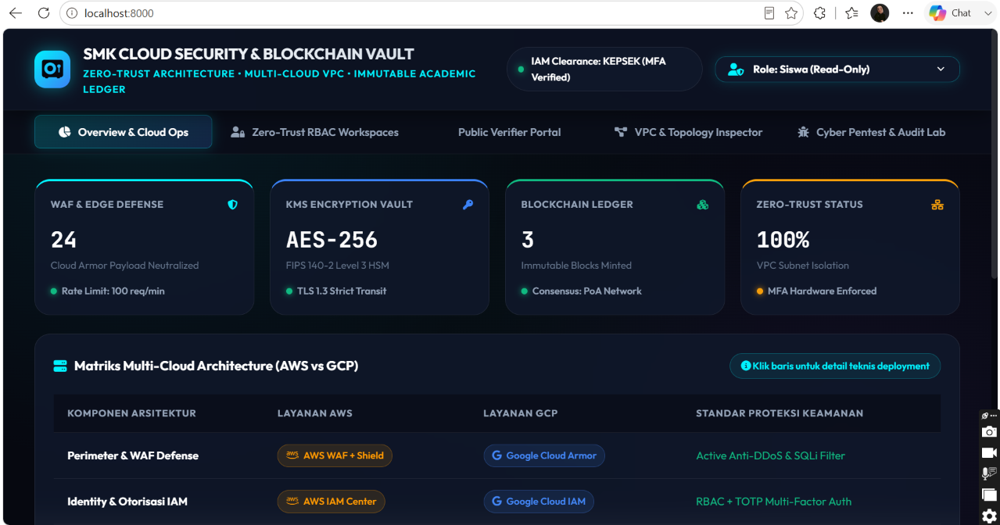

# 📸 Bukti Pengujian Web, Smart Contract Remix IDE & Ganache
### SMK Cloud Security & Blockchain Vault

Folder ini berisi dokumentasi hasil pengujian aplikasi **SMK Cloud Security & Blockchain Vault**, meliputi antarmuka web, implementasi Zero-Trust Architecture, Blockchain Ledger, Public Verifier, serta pengujian Smart Contract menggunakan **Remix IDE** dan **Ganache Provider**.

---

# 📑 Daftar Bukti Pengujian

## 1. 🌐 Dashboard Overview

**Deskripsi:**

Tampilan halaman utama aplikasi **SMK Cloud Security & Blockchain Vault** yang menampilkan ringkasan kondisi sistem secara real-time. Dashboard memperlihatkan implementasi arsitektur keamanan cloud berbasis **Zero Trust**, meliputi:

- WAF & Edge Defense
- KMS Encryption Vault (AES-256)
- Blockchain Ledger
- Zero-Trust Security Status
- Matriks Multi-Cloud Architecture (AWS vs Google Cloud)

Halaman ini menjadi pusat monitoring seluruh komponen keamanan sebelum pengguna mengakses modul lainnya.

---

## 2. 👨‍💼 Zero-Trust Workspace - Staf TU

**Deskripsi:**

Halaman kerja Staf Tata Usaha untuk memasukkan data kelulusan siswa yang nantinya diajukan kepada Kepala Sekolah untuk proses otorisasi digital.

---

## 3. 🔐 MFA Authentication Kepala Sekolah

**Deskripsi:**

Proses autentikasi Multi-Factor Authentication (MFA) sebelum Kepala Sekolah memperoleh hak akses terhadap proses penandatanganan digital menggunakan Cloud KMS.

---

## 4. ✍️ Cloud KMS Signing & Blockchain Minting

**Deskripsi:**

Kepala Sekolah melakukan proses penandatanganan digital menggunakan Cloud KMS Hardware Security Module sehingga data ijazah siap dicatat ke Blockchain Ledger.

---

## 5. ✅ Minting Berhasil

**Deskripsi:**

Notifikasi bahwa ijazah berhasil ditandatangani menggunakan Cloud KMS HSM dan tercatat pada Blockchain Ledger.

---

## 6. 👨‍🎓 Student Self Service

**Deskripsi:**

Dashboard siswa yang menampilkan seluruh ijazah digital yang telah diterbitkan beserta nilai hash SHA-256 serta fasilitas untuk mengunduh dokumen digital.

---

## 7. ✅ Public Verification (Dokumen Asli)

**Deskripsi:**

Portal verifikasi publik berhasil mencocokkan SHA-256 dokumen dengan Blockchain Ledger sehingga status ijazah dinyatakan **VALID**.

---

## 8. ❌ Public Verification (Dokumen Dimodifikasi)

**Deskripsi:**

Simulasi pemalsuan dokumen dengan perubahan satu karakter menyebabkan hash SHA-256 berubah sehingga Blockchain Ledger mendeteksi dokumen sebagai **INVALID/FALSIFIED**.

---

## 9. ⛓️ Block Payload & Immutability Chain

**Deskripsi:**

Detail payload Blockchain yang berisi informasi Block #3 meliputi identitas siswa, SHA-256 Document Hash, timestamp, signer Cloud KMS HSM, transaction hash, dan status validitas dokumen.

---

# 🔷 Pengujian Smart Contract (Remix IDE & Ganache)

## 10. 🚀 Deploy & Issue Certificate (`issueCertificate`)

**Deskripsi:**

Eksekusi fungsi `issueCertificate()` berhasil dilakukan melalui Remix IDE menggunakan Ganache Provider sehingga data ijazah tersimpan pada Blockchain.

---

## 11. 🔍 Verifikasi Certificate (`verifyCertificate`)

**Deskripsi:**

Pengujian fungsi `verifyCertificate()` mengembalikan status **isValid = true** beserta identitas pemilik ijazah yang tersimpan pada smart contract.

---

## 12. 🛡️ Zero-Trust Protection (Unauthorized Access)

**Deskripsi:**

Percobaan pemanggilan fungsi tanpa hak akses menghasilkan transaksi **Reverted**, membuktikan mekanisme RBAC pada smart contract berjalan dengan baik.

---

## 13. 👥 Grant Role (`grantRole`)

**Deskripsi:**

Administrator memberikan hak akses menggunakan fungsi `grantRole()` kepada akun mitra sehingga akun tersebut memperoleh izin sesuai prinsip Least Privilege.

---

## 14. 📖 Verifikasi Setelah Role Diberikan

**Deskripsi:**

Setelah role diberikan, akun yang telah diotorisasi berhasil melakukan proses pembacaan dan verifikasi sertifikat melalui smart contract.

---

## 15. 🖥️ Ganache Blockchain Network

**Deskripsi:**

Tampilan Ganache Provider yang digunakan sebagai private Ethereum Blockchain untuk proses deployment, transaksi, mining block, serta pengujian Smart Contract selama implementasi sistem.
